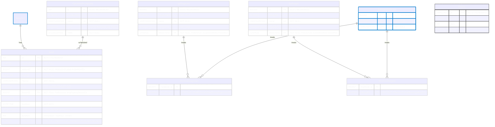

```mermaid
erDiagram

    PATIENT ||--o{ Book : "has"
    OperationProcedures ||--o{ Book : "scheduled"

    listDiagnosis ||--o{ MedicineDiagnosis : "treats"
    listAlergies ||--o{ MedicineAlergies : "treats"
    AvailableMedicines ||--o{ MedicineDiagnosis : "treats"
    AvailableMedicines ||--o{ MedicineAlergies : "treats"

    AvailableMedicines {
        BIGINT id PK "AUTO INCREMENT"
        CHAR(5) MID "NOT NULL"
        VARCHAR(100) name UK "NOT NULL"
    }

    MedicineDiagnosis {
        BIGINT medicine_id FK
        CHAR(5) diagnosisID FK "NOT NULL References listDiagnosis(diagnosisID)"
    }

    MedicineAlergies {
        BIGINT medicine_id FK
        CHAR(5) allergyID FK "NOT NULL References listAlergies(allergyID)"
    }

    listDiagnosis {
        BIGINT id PK "AUTO INCREMENT"
        CHAR(5) diagnosisID UK "NOT NULL"
        VARCHAR(255) name UK "NOT NULL"
        VARCHAR(255) symptoms "NOT NULL"
        CHAR(5) MedicineID FK "NOT NULL References AvailableMedecines(MID)"
    }

    listAlergies {
        BIGINT id PK "AUTO INCREMENT"
        CHAR(5) allergyID UK "NOT NULL"
        VARCHAR(255) name UK "NOT NULL"
        VARCHAR(255) symptoms "NOT NULL"
        CHAR(5) MedicineID FK "NOT NULL References AvailableMedecines(MID)"
    }

    Rooms {
        SMALLINT id PK "AUTO INCREMENT"
        CHAR(5) roomID UK "NOT NULL"
        INT floor ""
        CHAR(1) Wing ""
    }

    OperationProcedures {
        INT id PK "AUTO INCREMENT"
        CHAR(5) procedureID UK "NOT NULL"
        VARCHAR(255) name UK "NOT NULL"
        DECIMAL cost "(8,2) UNSIGNED NOT NULL"
        procedureTime TIME "NOT NULL"
    }

    Book {
        INT id PK "AUTO INCREMENT"
        CHAR(5) bookingID UK "NOT NULL"
        BIGINT patientID FK "NOT NULL References patients(patientID)"
        SMALLINT roomID UK "NOT NULL"
        VARCHAR(255) rName "NOT NULL"
        DECIMAL cost "(8,2) UNSIGNED NOT NULL"
        BIGINT doctorID FK "NOT NULL References employees(doctorID)"
        DATETIME bookin "NOT NULL"
        DATETIME bookout "NOT NULL"
        VARCHAR(9) status "In use | Cancelled | Available"
        INT duration "Generated - bookout - bookin"
        CHAR(5) procedureID FK "NOT NULL References operationProcedures(procedureID)"
    }

    classDef regular color: #f5f5f5, stroke: #555555, stroke-width:1px
    classDef default color: #f5f5f5, stroke: #D3D3D3, stroke-width:1px
    classDef highlight color: #f5f5f5, stroke: #007acc, stroke-width:3px

    Rooms ::: regular
    PATIENT::: highlight
    AvailableMedicines ::: highlight
```