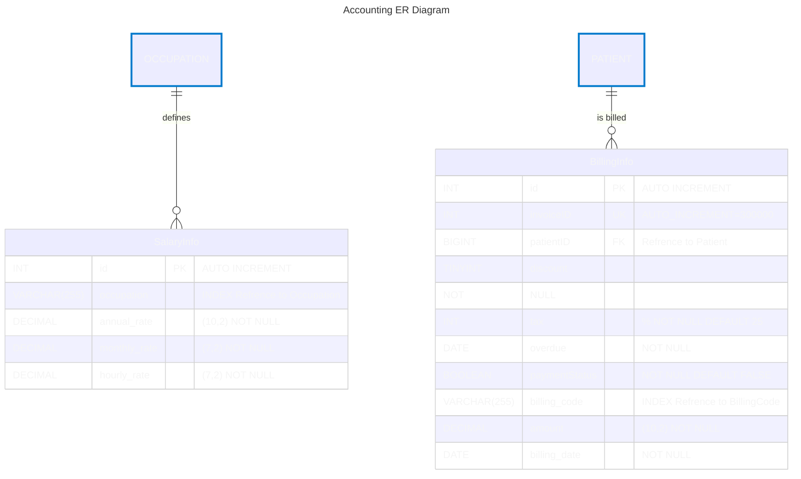

```mermaid
---
title: "Accounting ER Diagram"
---
erDiagram

        OCCUPATION ||--o{ SalaryInfo : "defines"
        PATIENT ||--o{ BillingInfo : "is billed"
    SalaryInfo {
        INT id PK "AUTO INCREMENT"
        VARCHAR(255) occupation "INDEX Refrence to Occupation"
        DECIMAL annual_rate "(10,2) NOT NULL"
        DECIMAL monthly_rate "(7,2) NOT NULL"
        DECIMAL hourly_rate "(7,2) NOT NULL"
    }

    BillingInfo {
        INT id PK "AUTO INCREMENT"
        INT invoiceID UK "AUTO_INCREMENT=300000"
        BIGINT patientID FK "Refrence to Patient"
        TINYINT discount NOT NULL
        INT tax "% NOT NULL DEFAULT 25"
        DATE overdue "NOT NULL"
        BOOLEAN paymentStatus "NOT NULL DEFAULT FALSE"
        VARCHAR(255) billing_code "INDEX Refrence to BillingCode"
        DECIMAL amount "(10,2) NOT NULL"
        DATE billing_date "NOT NULL"
    }

    classDef default color: #f5f5f5, stroke: #D3D3D3, stroke-width:1px
    classDef highlight color: #f5f5f5, stroke: #007acc, stroke-width:3px

    OCCUPATION::: highlight
    PATIENT ::: highlight
```