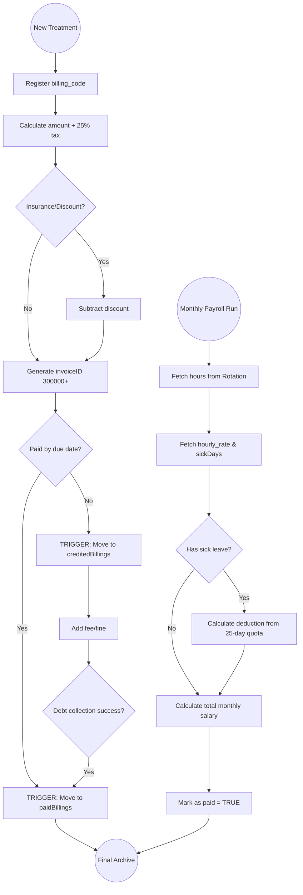

---
---

```mermaid
flowchart TD
    %% Starting Points
    Start1((New Treatment)) --> Treatment[Register billing_code]
    Start2((Monthly Payroll Run)) --> PayrollProcess[Fetch hours from Rotation]

    %% Billing Logic
    Treatment --> CalcAmount[Calculate amount + 25% tax]
    CalcAmount --> DiscountCheck{Insurance/Discount?}
    DiscountCheck -- Yes --> ApplyDiscount[Subtract discount]
    DiscountCheck -- No --> GenerateInvoice[Generate invoiceID 300000+]
    ApplyDiscount --> GenerateInvoice
    GenerateInvoice --> DueCheck{Paid by due date?}

    %% Overdue and Archive Logic
    DueCheck -- Yes --> TriggerPaid[TRIGGER: Move to paidBillings]
    DueCheck -- No --> TriggerCredit[TRIGGER: Move to creditedBillings]
    TriggerCredit --> AddFine[Add fee/fine]
    AddFine --> DebtCollection{Debt collection success?}
    DebtCollection -- Yes --> TriggerPaid
    
    %% Payroll Logic
    PayrollProcess --> SalaryData[Fetch hourly_rate & sickDays]
    SalaryData --> SickCheck{Has sick leave?}
    SickCheck -- Yes --> CalcSick[Calculate deduction from 25-day quota]
    SickCheck -- No --> CalcPayout[Calculate total monthly salary]
    CalcSick --> CalcPayout
    CalcPayout --> PayConfirm[Mark as paid = TRUE]

    %% Endpoints
    TriggerPaid --> Archive((Final Archive))
    PayConfirm --> Archive
```