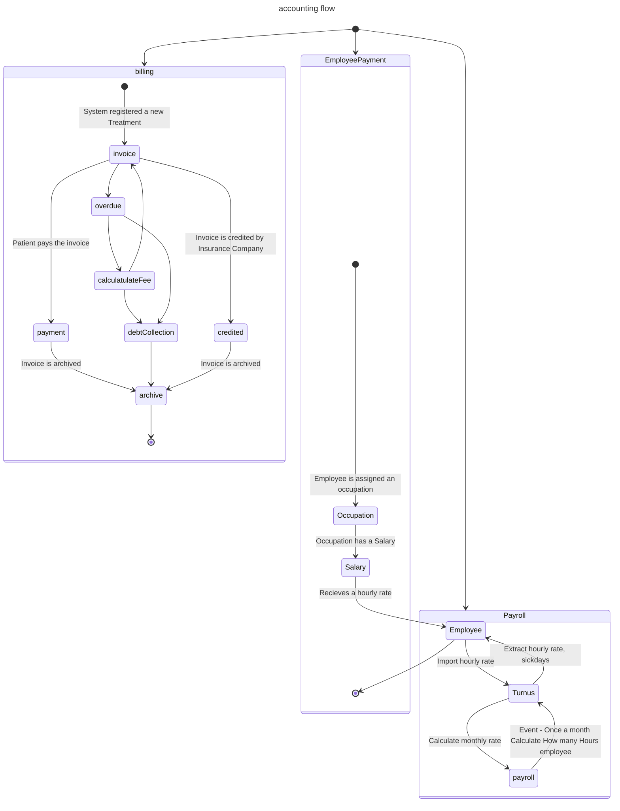

```mermaid
---
title: accounting flow
---
stateDiagram-v2
[*] --> billing

    state billing {
    [*] --> invoice: System registered a new Treatment
    invoice --> payment: Patient pays the invoice
    payment --> archive: Invoice is archived

    invoice --> overdue
    overdue --> calculatulateFee
    calculatulateFee --> invoice
    calculatulateFee --> debtCollection
    overdue --> debtCollection
    debtCollection --> archive

    invoice --> credited : Invoice is credited by Insurance Company
    credited --> archive: Invoice is archived
    archive --> [*]
    }

[*] --> EmployeePayment

    state EmployeePayment 
    {
        [*] --> Occupation: Employee is assigned an occupation
        Occupation --> Salary: Occupation has a Salary
        Salary --> Employee: Recieves a hourly rate
        Employee --> [*]
    }

[*] --> Payroll

    state Payroll
    {
        payroll --> Turnus: Event - Once a month Calculate How many Hours employee
        Turnus --> Employee: Extract hourly rate, sickdays
        Employee --> Turnus: Import hourly rate
        Turnus --> payroll: Calculate monthly rate
        
    }
```