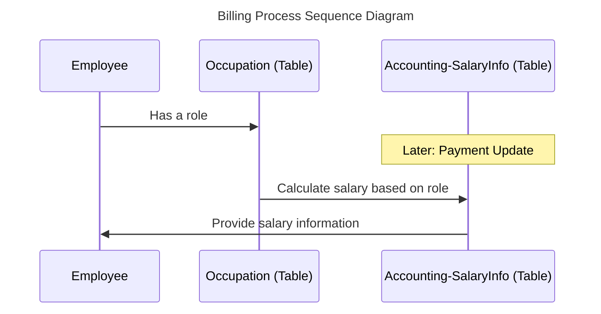

```mermaid
---
title : Billing Process Sequence Diagram
---
sequenceDiagram
    participant Doc as Employee
    participant Oc as Occupation (Table)
    participant acc as Accounting-SalaryInfo (Table)

    Doc->>Oc: Has a role
    Note over acc: Later: Payment Update
    Oc->>acc: Calculate salary based on role
    acc->>Doc: Provide salary information
```