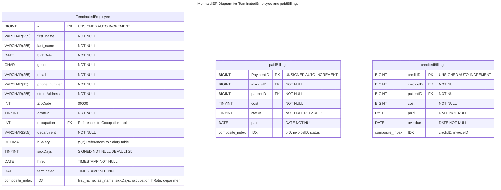

```mermaid
---
title: "Mermaid ER Diagram for TerminatedEmployee and paidBillings"
---
erDiagram

    TerminatedEmployee  {
        BIGINT id PK "UNSIGNED AUTO INCREMENT"
        VARCHAR(255) first_name "NOT NULL"
        VARCHAR(255) last_name "NOT NULL"
        DATE birthDate "NOT NULL"
        CHAR gender "NOT NULL"
        VARCHAR(255) email "NOT NULL"
        VARCHAR(15) phone_number "NOT NULL"
        VARCHAR(255) streetAddress "NOT NULL"
        INT ZipCode "00000"
        TINYINT estatus "NOT NULL"
        INT occupation FK "References to Occupation table" 
        VARCHAR(255) department "NOT NULL"
        DECIMAL hSalary "(9,2) References to Salary table"
        TINYINT sickDays "SIGNED NOT NULL DEFAULT 25"
        DATE hired "TIMESTAMP NOT NULL"
        DATE terminated "TIMESTAMP NOT NULL"
        composite_index IDX "first_name, last_name, sickDays, occupation, hRate, department"
    }
    paidBillings {
        BIGINT PaymentID PK "UNSIGNED AUTO INCREMENT"
        BIGINT invoiceID FK "NOT NULL"
        BIGINT patientID FK "NOT NULL"
        TINYINT cost "NOT NULL"
        TINYINT status "NOT NULL DEFAULT 1"
        DATE paid "DATE NOT NULL"
        composite_index IDX "pID, invoiceID, status"
    }
    creditedBillings {
        BIGINT creditID PK "UNSIGNED AUTO INCREMENT"
        BIGINT invoiceID FK "NOT NULL"
        BIGINT patientID FK "NOT NULL"
        BIGINT cost "NOT NULL"
        DATE paid "DATE NOT NULL"
        DATE overdue "DATE NOT NULL"
        composite_index IDX "creditID, invoiceID"
    }

```