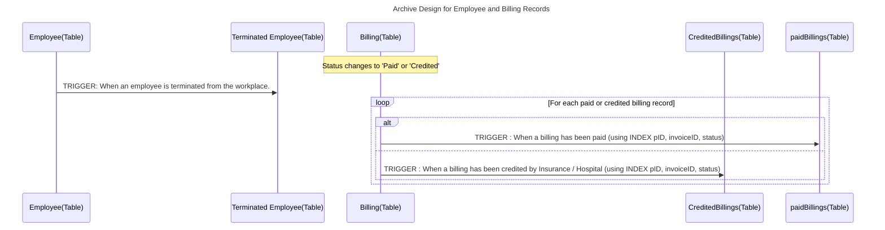

    classDef regular color: #f5f5f5, stroke: #555555, stroke-width:1px
    classDef default color: #f5f5f5, stroke: #D3D3D3, stroke-width:1px
    classDef highlight color: #f5f5f5, stroke: #007acc, stroke-width:3px

    Rooms ::: regular
    PATIENT::: highlight
    AvailableMedicines ::: highlight