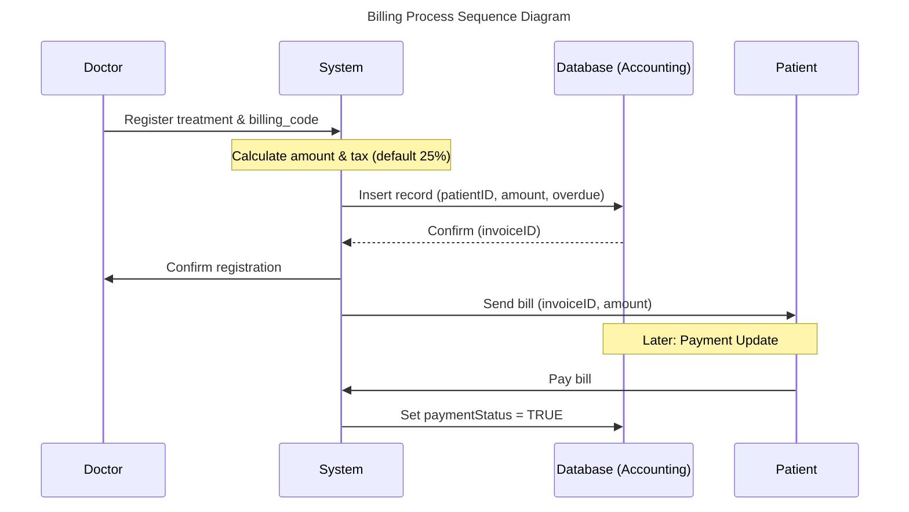

```mermaid
---
title : Billing Process Sequence Diagram
---
sequenceDiagram

    participant Doc as Doctor
    participant HOS as System
    participant DB as Database (Accounting)
    participant P as Patient

    Doc->>HOS: Register treatment & billing_code
    Note over HOS: Calculate amount & tax (default 25%)
    
    HOS->>DB: Insert record (patientID, amount, overdue)
    DB-->>HOS: Confirm (invoiceID)
    
    HOS->>Doc: Confirm registration
    
    HOS->>P: Send bill (invoiceID, amount)
    
    Note over P, DB: Later: Payment Update
    P->>HOS: Pay bill
    HOS->>DB: Set paymentStatus = TRUE
```