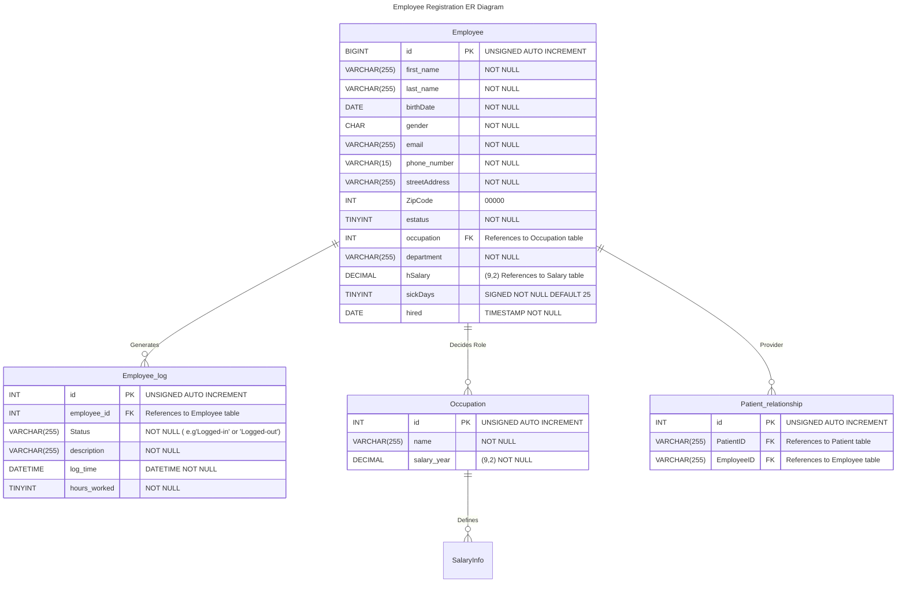

```mermaid
---
title: "Employee Registration ER Diagram"
---
erDiagram
    Employee ||--o{ Employee_log : "Generates"
    Employee ||--o{ Occupation : "Decides Role"
    Employee ||--o{ Patient_relationship : "Provider"
    Occupation ||--o{ SalaryInfo: "Defines"

    Employee {
        BIGINT id PK "UNSIGNED AUTO INCREMENT"

        VARCHAR(255) first_name "NOT NULL"
        VARCHAR(255) last_name "NOT NULL"
        DATE birthDate "NOT NULL"
        CHAR gender "NOT NULL"
        VARCHAR(255) email "NOT NULL"
        VARCHAR(15) phone_number "NOT NULL"
        VARCHAR(255) streetAddress "NOT NULL"
        INT ZipCode "00000"

        TINYINT estatus "NOT NULL"
        INT occupation FK "References to Occupation table" 
        VARCHAR(255) department "NOT NULL"
        DECIMAL hSalary "(9,2) References to Salary table"
        TINYINT sickDays "SIGNED NOT NULL DEFAULT 25"
        DATE hired "TIMESTAMP NOT NULL"
    }

    Employee_log {
        INT id PK "UNSIGNED AUTO INCREMENT"
        INT employee_id FK "References to Employee table"
        VARCHAR(255) Status  "NOT NULL ( e.g'Logged-in' or 'Logged-out')"
        VARCHAR(255) description "NOT NULL"
        DATETIME log_time "DATETIME NOT NULL"
        TINYINT hours_worked "NOT NULL"
    }

    Occupation {
        INT id PK "UNSIGNED AUTO INCREMENT"
        VARCHAR(255) name "NOT NULL"
        DECIMAL salary_year "(9,2) NOT NULL"
    }

    Patient_relationship {
        INT id PK "UNSIGNED AUTO INCREMENT"
        VARCHAR(255) PatientID FK "References to Patient table"
        VARCHAR(255) EmployeeID FK "References to Employee table"
    }
```