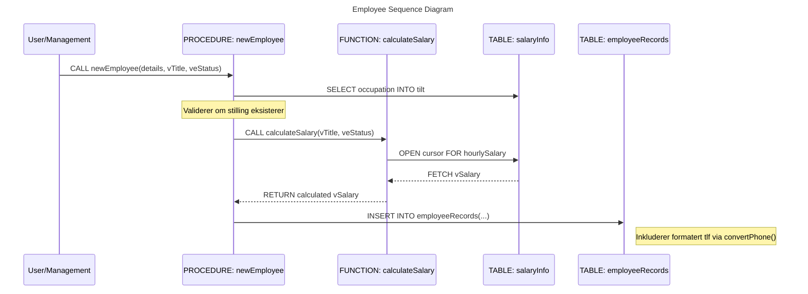

```mermaid
---
title: "Employee Sequence Diagram"
---
sequenceDiagram
    participant Admin as User/Management
    participant Proc as PROCEDURE: newEmployee
    participant Func as FUNCTION: calculateSalary
    participant SI as TABLE: salaryInfo
    participant ER as TABLE: employeeRecords

    Admin->>Proc: CALL newEmployee(details, vTitle, veStatus)
    
    Proc->>SI: SELECT occupation INTO tilt
    Note over Proc: Validerer om stilling eksisterer
    
    Proc->>Func: CALL calculateSalary(vTitle, veStatus)
    Func->>SI: OPEN cursor FOR hourlySalary
    SI-->>Func: FETCH vSalary
    Func-->>Proc: RETURN calculated vSalary
    
    Proc->>ER: INSERT INTO employeeRecords(...)
    Note right of ER: Inkluderer formatert tlf via convertPhone()
```