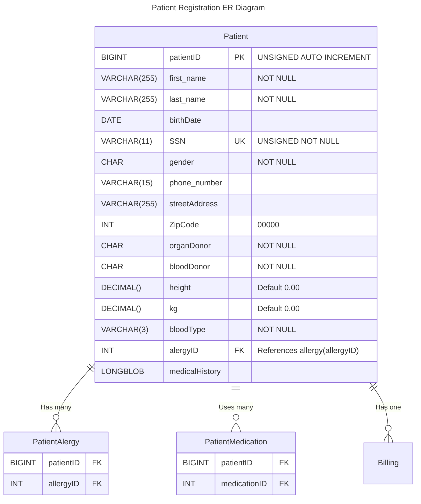

```mermaid
---
title: "Patient Registration ER Diagram"
---
erDiagram

    Patient ||--o{ PatientAlergy : "Has many"
    Patient ||--o{ PatientMedication : "Uses many"
    Patient ||--o{ Billing : "Has one"
    
    Patient {
        BIGINT patientID PK "UNSIGNED AUTO INCREMENT"
        VARCHAR(255) first_name "NOT NULL"
        VARCHAR(255) last_name "NOT NULL"
        DATE birthDate 
        VARCHAR(11) SSN UK "UNSIGNED NOT NULL"
        CHAR gender "NOT NULL"
        VARCHAR(15) phone_number
        VARCHAR(255) streetAddress
        INT ZipCode "00000"

        CHAR organDonor "NOT NULL"
        CHAR bloodDonor "NOT NULL"
        DECIMAL() height "Default 0.00"
        DECIMAL() kg "Default 0.00"
        VARCHAR(3) bloodType "NOT NULL"
        INT alergyID FK "References allergy(allergyID)"
        LONGBLOB medicalHistory ""
    }

    PatientAlergy {
        BIGINT patientID FK
        INT allergyID FK
    }

    PatientMedication {
        BIGINT patientID FK
        INT medicationID FK
    }
```