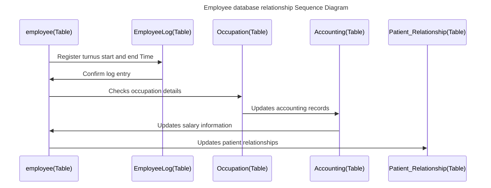

```mermaid
---
title: "Employee database relationship Sequence Diagram"
---
sequenceDiagram
    participant EMP as employee(Table)
    participant ELOG as EmployeeLog(Table)
    participant OCC as Occupation(Table)
    participant ACC as Accounting(Table)
    participant PR as Patient_Relationship(Table)

    EMP->>ELOG: Register  turnus start and end Time
    ELOG->>EMP: Confirm log entry
    EMP->>OCC: Checks occupation details
    OCC->>ACC: Updates accounting records
    ACC->>EMP: Updates salary information
    EMP->>PR: Updates patient relationships
```