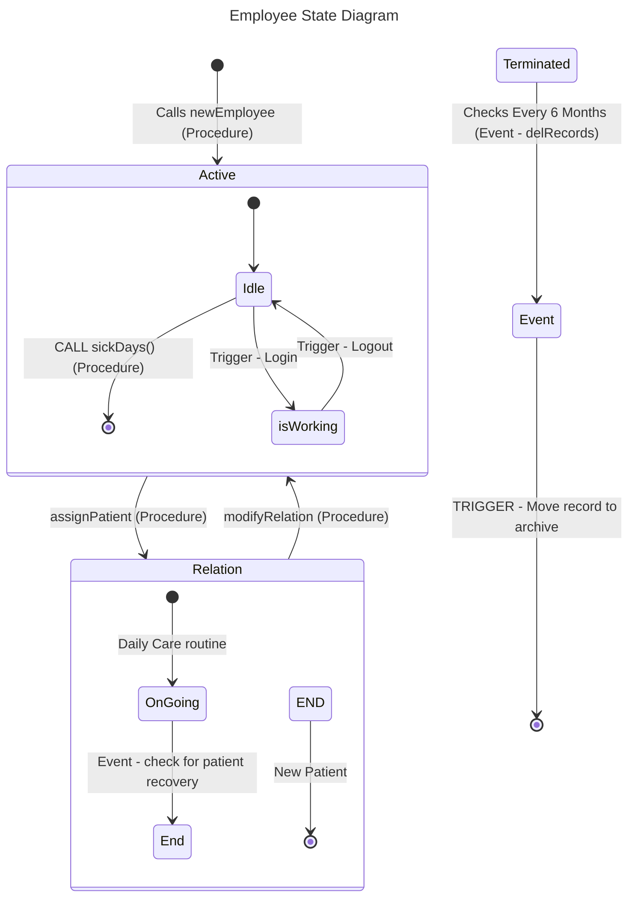

```mermaid
---
title: "Employee State Diagram"
---
stateDiagram-v2
    [*] --> Active: Calls newEmployee (Procedure)
    state Active {
        [*] --> Idle
        Idle --> [*]: CALL sickDays()  (Procedure)
        Idle --> isWorking: Trigger - Login
        isWorking--> Idle: Trigger - Logout
    }
    Active --> Relation: assignPatient (Procedure)

    state Relation {
        [*] --> OnGoing: Daily Care routine
        OnGoing --> End: Event - check for patient recovery
        END --> [*]: New Patient
    }
    Relation --> Active: modifyRelation (Procedure)
    Terminated --> Event : Checks Every 6 Months (Event - delRecords)
    Event --> [*]: TRIGGER - Move record to archive
```