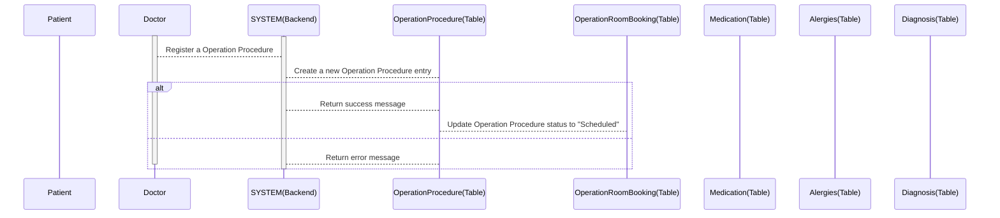

```mermaid
sequenceDiagram
    participant Patient
    participant DOC as Doctor
    participant SYS as SYSTEM(Backend)
    participant OP as OperationProcedure(Table)
    participant Book as OperationRoomBooking(Table)

    activate DOC
    activate SYS
    DOC --> SYS: Register a Operation Procedure
    SYS --> OP: Create a new Operation Procedure entry
    alt
        OP --> SYS: Return success message
        OP --> Book: Update Operation Procedure status to "Scheduled"
    else
        OP --> SYS: Return error message
        deactivate DOC
    end

    deactivate SYS

    participant MED as Medication(Table)
    participant AM as Alergies(Table)
    participant DM as Diagnosis(Table)
```