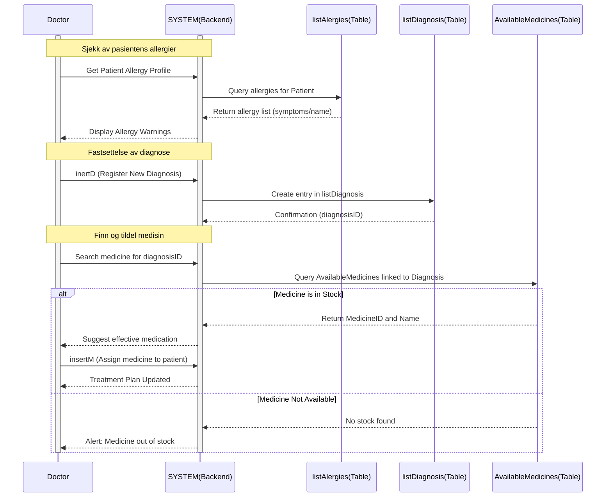

```mermaid
sequenceDiagram
    participant DOC as Doctor
    participant SYS as SYSTEM(Backend)
    participant ALG as listAlergies(Table)
    participant DIA as listDiagnosis(Table)
    participant MED as AvailableMedicines(Table)

    activate DOC
    activate SYS

    Note over DOC, SYS: Sjekk av pasientens allergier
    DOC ->> SYS: Get Patient Allergy Profile
    SYS ->> ALG: Query allergies for Patient
    ALG -->> SYS: Return allergy list (symptoms/name)
    SYS -->> DOC: Display Allergy Warnings

    Note over DOC, SYS: Fastsettelse av diagnose
    DOC ->> SYS: inertD (Register New Diagnosis)
    SYS ->> DIA: Create entry in listDiagnosis
    DIA -->> SYS: Confirmation (diagnosisID)

    Note over DOC, SYS: Finn og tildel medisin
    DOC ->> SYS: Search medicine for diagnosisID
    SYS ->> MED: Query AvailableMedicines linked to Diagnosis
    
    alt Medicine is in Stock
        MED -->> SYS: Return MedicineID and Name
        SYS -->> DOC: Suggest effective medication
        DOC ->> SYS: insertM (Assign medicine to patient)
        SYS -->> DOC: Treatment Plan Updated
    else Medicine Not Available
        MED -->> SYS: No stock found
        SYS -->> DOC: Alert: Medicine out of stock
    end

    deactivate SYS
    deactivate DOC
```