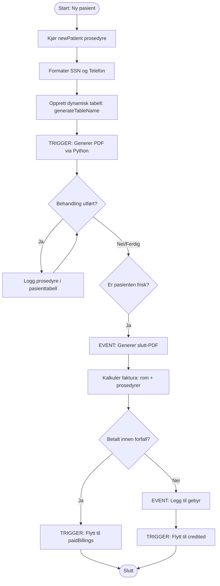

```mermaid
flowchart TD
    Start([Start: Ny pasient]) --> NewP[Kjør newPatient prosedyre]
    NewP --> Format[Formater SSN og Telefon]
    Format --> CreateTab[Opprett dynamisk tabell: generateTableName]
    CreateTab --> TriggerPDF[TRIGGER: Generer PDF via Python]
    
    TriggerPDF --> Treatment{Behandling utført?}
    Treatment -- Ja --> LogProc[Logg prosedyre i pasienttabell]
    LogProc --> Treatment
    Treatment -- Nei/Ferdig --> Recovery{Er pasienten frisk?}
    
    Recovery -- Ja --> FinalPDF[EVENT: Generer slutt-PDF]
    FinalPDF --> Billing[Kalkuler faktura: rom + prosedyrer]
    
    Billing --> PayCheck{Betalt innen forfall?}
    PayCheck -- Ja --> ArchivePaid[TRIGGER: Flytt til paidBillings]
    PayCheck -- Nei --> Overdue[EVENT: Legg til gebyr]
    Overdue --> ArchiveCredit[TRIGGER: Flytt til credited]
    
    ArchivePaid --> End([Slutt])
    ArchiveCredit --> End
```