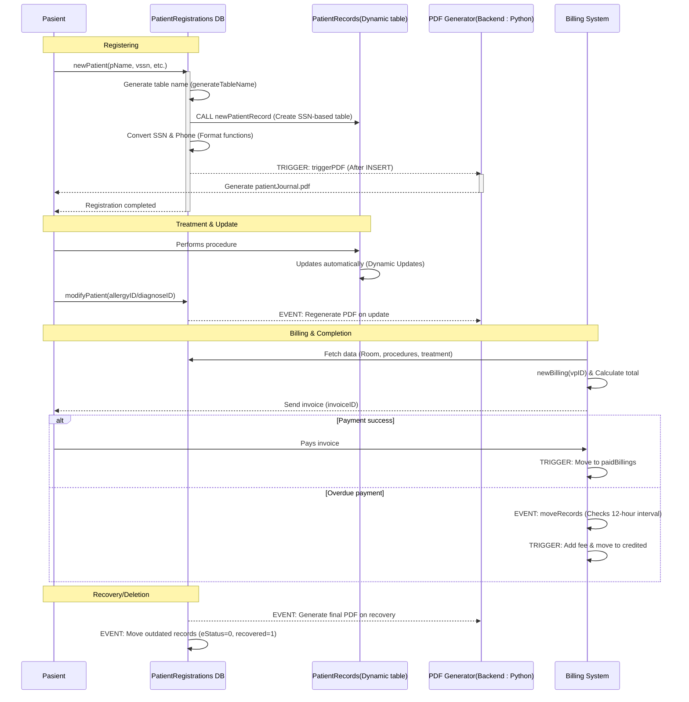

```mermaid
sequenceDiagram
    participant P as Pasient
    participant DB as PatientRegistrations DB
    participant PR as PatientRecords(Dynamic table)
    participant PDF as PDF Generator(Backend : Python)
    participant B as Billing System

    Note over P, DB: Registering
    P->>DB: newPatient(pName, vssn, etc.)
    activate DB
    DB->>DB: Generate table name (generateTableName)
    DB->>PR: CALL newPatientRecord (Create SSN-based table)
    DB->>DB: Convert SSN & Phone (Format functions)
    DB-->>PDF: TRIGGER: triggerPDF (After INSERT)
    activate PDF
    PDF-->>P: Generate patientJournal.pdf
    deactivate PDF
    DB-->>P: Registration completed
    deactivate DB

    Note over P, PR: Treatment & Update
    P->>PR: Performs procedure
    PR->>PR: Updates automatically (Dynamic Updates)
    P->>DB: modifyPatient(allergyID/diagnoseID)
    DB-->>PDF: EVENT: Regenerate PDF on update

    Note over P, B: Billing & Completion
    B->>DB: Fetch data (Room, procedures, treatment)
    B->>B: newBilling(vpID) & Calculate total
    B-->>P: Send invoice (invoiceID)
    
    alt Payment success
        P->>B: Pays invoice
        B->>B: TRIGGER: Move to paidBillings
    else Overdue payment
        B->>B: EVENT: moveRecords (Checks 12-hour interval)
        B->>B: TRIGGER: Add fee & move to credited
    end

    Note over P, DB: Recovery/Deletion
    DB-->>PDF: EVENT: Generate final PDF on recovery
    DB->>DB: EVENT: Move outdated records (eStatus=0, recovered=1)
```